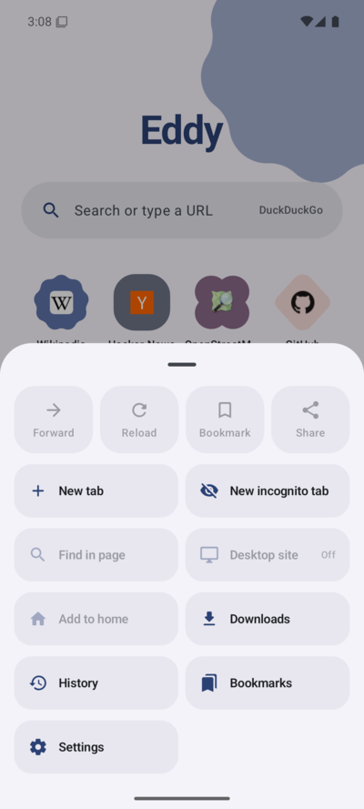
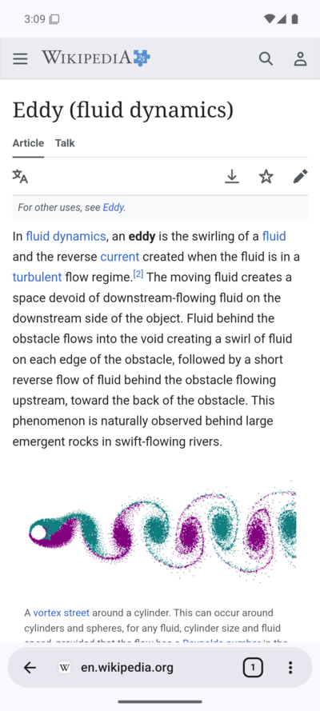
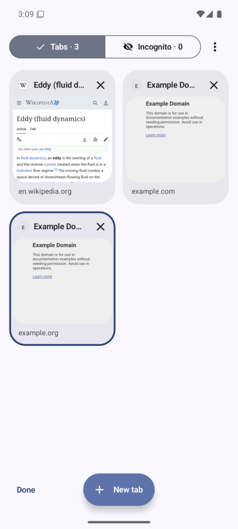
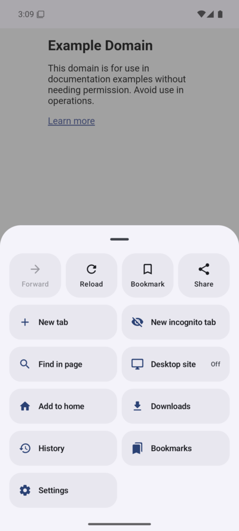
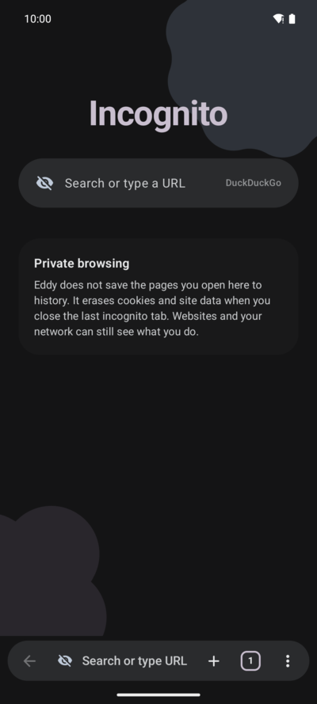
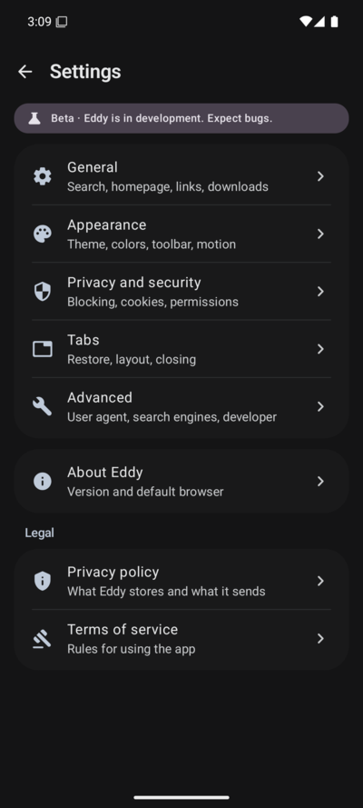
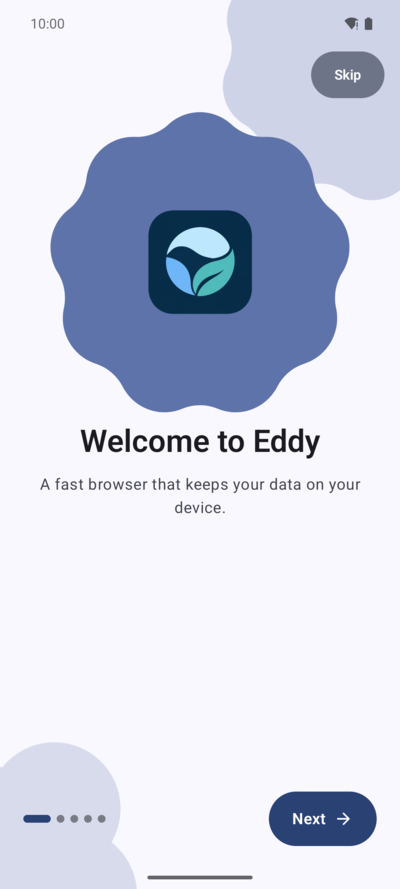
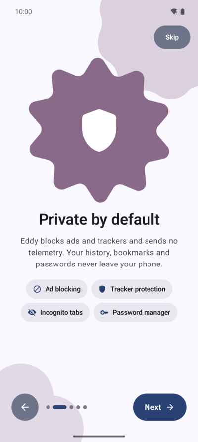
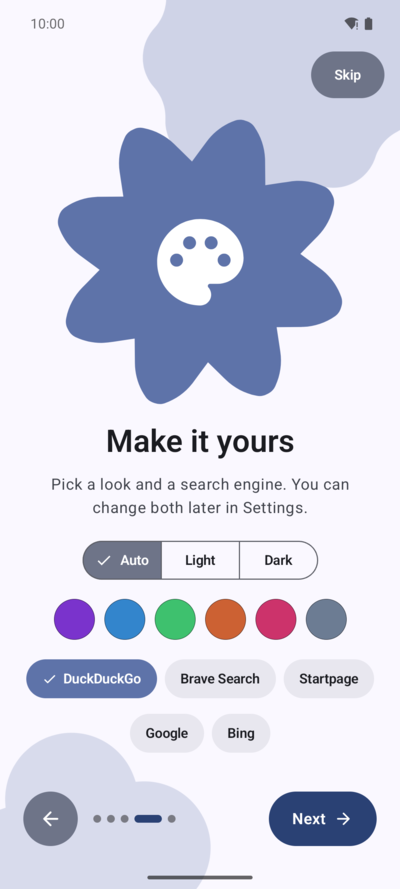

<p align="center"></p>

# Eddy

> **Beta.** Eddy is in active development. Expect rough edges.

A fast, lightweight, privacy-focused Android browser built on the system WebView, with a Material 3
Expressive interface. Kotlin, Jetpack Compose, no ads, no analytics, no telemetry.

Eddy is an original app. It takes its *feel* (floating one-hand chrome, expressive shapes, springy
motion, a calm start page) from the lightweight-browser school of design, but shares no code, name,
icons or assets with any other browser.

## Screenshots

<p align="center">
  
  
  
</p>
<p align="center">
  
  
  
</p>

The welcome tour on first launch:

<p align="center">
  
  
  
</p>

## Build

Requirements: JDK 21+ (tested on 26), Android SDK with platform 37 and build-tools 37.

```
./gradlew :app:assembleDebug        # debug APK
./gradlew :app:assembleRelease      # R8-shrunk release APK (~3.5 MB, unsigned)
./gradlew :app:testDebugUnitTest    # unit tests
./gradlew :app:lintDebug            # lint
```

`minSdk 29`, `targetSdk 37`. Stack: AGP 9.4, Kotlin 2.4, Compose BOM 2026.09 with Material 3
1.5 (Expressive), Room, DataStore, androidx.webkit, androidx.graphics-shapes.
No image-loading library: favicons and thumbnails are handled by small dedicated caches.

## Packaging

Store listing text and screenshots live in `fastlane/metadata/android/en-US/`, the layout F-Droid
and IzzyOnDroid read directly from the repository.

The F-Droid build recipe and the steps for submitting it are in [`fdroid/`](fdroid/README.md). That
build drops `app/src/main/assets/eruda.min.js`, a prebuilt bundle F-Droid does not accept; the app
detects the missing asset and hides the developer-tools toggle. Everything else is unchanged.

## Architecture

```
app/src/main/java/app/eddy/browser/
  EddyApp, AppContainer      manual DI; everything heavy is lazy
  MainActivity               edge-to-edge host, file chooser, runtime permissions, fullscreen/PiP
  browser/
    BrowserViewModel         single source of UI state (screens, omnibox, prompts, find, chrome)
    TabManager               tab list, live-WebView budget, eviction, persistence, closed-tab stack
    BrowserTab               per-tab snapshot state
    WebViewFactory           builds WebViews, applies global + per-site policy (JS, UA, cookies, blocking)
    EddyWebViewClient/ChromeClient, EddyWebView (scroll + pull-to-refresh callbacks)
    Prompts                  permission coordinator, prompt/effect models
    BrowserScreen, Omnibox, MenuSheet, SiteInfoSheet, ErrorPage, ...   Compose UI
  home/  tabs/  bookmarks/  history/  downloads/  settings/           feature screens
  privacy/                   ContentBlocker, SitePermissions, FilterUpdateService
  data/                      models, DataStore settings, Room database
  ui/                        theme (palettes, tokens), shapes (morphing), components, animation
```

Browsing logic (tabs, WebView policy, blocking, downloads) is independent of Compose; the UI only
observes snapshot state and calls ViewModel functions. Anything needing an Activity (file picker,
runtime permissions, external apps, fullscreen video) leaves the ViewModel as a `UiEffect`.

### Notable behaviours

- **Tabs and memory.** At most four WebViews stay alive. Older tabs are serialised (full back/forward
  history) and rebuilt on demand; `onTrimMemory` drops all but the visible one. Tab state survives
  process death. Previews live in a byte-bounded LRU and on disk.
- **Incognito.** Uses a separate WebView *profile* (androidx.webkit multi-profile) whose cookies and
  storage are deleted when the last incognito tab closes. On WebViews without multi-profile support
  incognito still skips history/cache/thumbnails but shares cookies (Settings > Privacy says so).
- **Blocking.** Host-based, parsed once into hash sets cached on disk, matched on WebView's IO
  thread in `shouldInterceptRequest`. Only third-party requests are blocked. Per-site switch, custom
  lists, daily background refresh via `JobScheduler`. Supports hosts files, domain lists and
  `||domain^` rules.
- **Downloads.** Own resumable HTTP engine (Range/ETag) with a foreground service; finished files are
  published to `Downloads` through MediaStore. Pause/resume, retry, speed, notifications.
- **Welcome tour.** First launch shows a five-step tour with a hero shape that morphs as you swipe. Theme, colours, search engine and toolbar position apply to the real settings live. It is skipped when the app opens from a link, and Settings > About can replay it.
- **Passwords.** Sign-in and sign-up forms are detected by a script injected through `addWebMessageListener`; Eddy asks to save or update only after the sign-in succeeds. Passwords are AES-256-GCM encrypted with an Android Keystore key, autofill needs a tap and matches the exact origin, and the manager sits behind the device screen lock with `FLAG_SECURE`. Passwords import and export as Chrome-style CSV (`name,url,username,password,note`); export warns that the file is plain text.
- **Safety.** Certificate errors show a native page; proceeding requires an explicit confirmation and
  sub-resource errors are always cancelled. Background-triggered external-app launches are ignored.

## Known limitations

- WebView does not implement the Web Notifications API, so there is no per-site notification switch.
- `blob:` downloads and password autofill need a recent Android System WebView. On older ones Eddy says so and turns the password switches off.
- Blocking is domain-based only; there is no cosmetic (element-hiding) filtering.
- User-facing strings are inline English, not yet extracted to resources.

## Privacy and legal

Eddy has no advertising, analytics or telemetry. The full text is in [PRIVACY.md](PRIVACY.md) and
[TERMS.md](TERMS.md); both mirror what the app shows under Settings > Legal.

## License

Licensed under the [Apache License 2.0](LICENSE).
